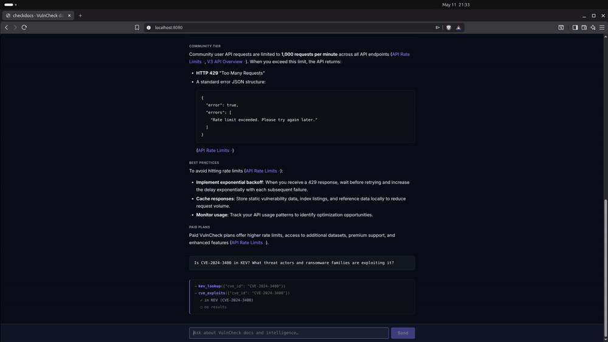

# checkdocs

> Agentic Q&A over the [VulnCheck](https://docs.vulncheck.com) documentation, live intelligence API, and vulnerability-research notebooks — a BM25-indexed, locally-served assistant built in Go.

[](https://github.com/nethoundsh/checkdocs/actions/workflows/test.yml)
[](LICENSE)

Built in Go. Default model: `anthropic/claude-sonnet-4.5` via OpenRouter (swap with any compatible model via flag). A VulnCheck API token unlocks live intelligence queries; a Brave Search API key unlocks web search and vendor CVE enumeration.



▶️ **[Watch the full 2-minute demo](https://github.com/user-attachments/assets/644173bc-31f3-48b8-99b4-e52a7da7038c)**

---

## Background

VulnCheck publishes excellent documentation and intelligence data, but answering operational questions — "is this CVE actively exploited?", "which vendors have the most KEV entries this quarter?", "do detection rules exist for this vulnerability?" — means cross-referencing the docs site, the live v3 API, and their open-source research notebooks by hand. `checkdocs` unifies those three sources behind a single agent interface: ask in plain English, get a cited answer drawn from whichever sources are relevant.

---

## What it does

`checkdocs` scrapes the full VulnCheck documentation, indexes it locally with SQLite FTS5, and wraps it in a tool-using LLM agent. Ask a natural-language question about VulnCheck's APIs, data endpoints, authentication, or intelligence products; the agent searches and reads the relevant pages and returns a cited answer grounded in retrieved content.

A second corpus — VulnCheck's open-source [vulnerability-research](https://github.com/vulncheck-oss/vulnerability-research) Jupyter notebooks — can be indexed alongside the docs. These notebooks contain KEV dashboards, exploitation timeline analysis, initial access coverage stats, canary detection metrics, reserved-but-exploited CVE lists, and trending data. Once synced, the agent can answer data questions like "how many CVEs were added to KEV in 2025?" or "which vendors have the most exploited CVEs?" by reading the notebook outputs directly.

With a VulnCheck API token, the agent gains four additional live-data tools that query `api.vulncheck.com/v3/` directly:

| Tool | What it answers |
|---|---|
| `kev_lookup` | Is this CVE in the KEV catalog? When was it added? Is it linked to ransomware campaigns? |
| `cve_exploits` | What botnets, ransomware families, or threat actors exploit this CVE? (queries available indices concurrently) |
| `detection_rules` | Give me Suricata or Snort rules for this CVE |
| `vulncheck_query` | Escape hatch — query any index by name with arbitrary parameters |

Without a VulnCheck token the tool surface is docs-only; the live tools are silently omitted from the agent's tool list.

With a Brave Search API key, the agent gains two additional tools:

| Tool | What it does |
|---|---|
| `web_search` | General web search — recent CVE disclosures, threat context, news about a CVE or threat actor |
| `find_vendor_cves` | Composite: searches the web for `{vendor} CVE {year}`, extracts CVE IDs from results, and enriches each with VulnCheck KEV status (if a VulnCheck token is also present) |

`find_vendor_cves` is the correct tool for "are there any OPNsense vulnerabilities?" style questions — it replaces the brute-force CVE ID enumeration pattern that a model without web access would otherwise attempt.

When the research corpus is synced, the agent gains one more tool:

| Tool | What it does |
|---|---|
| `search_research` | BM25 search over indexed notebook content — markdown prose, HTML table data, Plotly chart titles and category labels |

`search_research` results can then be fetched in full with `fetch_page` using the `research://` URL returned in the result, giving the agent access to complete notebook outputs including KEV statistics tables and vendor/product breakdowns.

Two interfaces ship: a **CLI** for quick lookups from the terminal and an **HTTP server** with a browser-based chat UI for longer research sessions.

*Example output (illustrative):*

```
$ go run ./cmd/agent "What endpoints are available for Initial Access Intelligence?"

→ search_docs({"query": "initial access intelligence endpoints"})
  ✓ search_docs: 5 pages

→ fetch_page({"url": "https://docs.vulncheck.com/products/initial-access-intelligence"})
  ✓ fetch_page: Initial Access Intelligence (4821 bytes)

VulnCheck's Initial Access Intelligence product exposes the following endpoints:

- **`/v3/backup/initial-access`** — bulk JSONL download of the full dataset
- **`/v3/index/initial-access`** — paginated, filterable index query

Both require a Bearer token. The bulk endpoint is rate-limited to one concurrent
download per API key. Source: [Initial Access Intelligence](https://docs.vulncheck.com/products/initial-access-intelligence)
```

---

## Quick start

Requires Go 1.26.3+, an OpenRouter API key, and optionally a VulnCheck token and Brave API key — see [Prerequisites](#prerequisites) for details.

### Docker (quickest path)

```bash
# 1. Populate the database (one-time)
docker compose --profile init up scrape

# 2. Start the server
docker compose up server
# Open http://localhost:8080 — click Keys to enter your OpenRouter API key.
```

### 1. Clone

```bash
git clone https://github.com/nethoundsh/checkdocs
cd checkdocs
```

### 2. Scrape and index the VulnCheck docs

```bash
go run ./cmd/scraper
# Fetches docs.vulncheck.com/llms.txt, downloads 102 pages, writes data/docs.db
# Takes ~2 minutes at the default 1-second politeness delay.
```

### 2b. (Optional) Index the vulnerability-research notebooks

```bash
git clone https://github.com/vulncheck-oss/vulnerability-research research
go run ./cmd/research-sync
# Parses 14 notebooks, upserts into data/docs.db with research:// URLs.
# Instant — no network calls, reads local .ipynb files only.
```

After this step the agent automatically gains the `search_research` tool and will use it for questions about KEV statistics, vendor coverage, exploitation trends, and other data found in the notebooks.

### 3a. Run the CLI agent

```bash
cp .env.example .env
# Edit .env and set OPENROUTER_API_KEY (and optionally VULNCHECK_API_TOKEN, BRAVE_API_KEY)

go run ./cmd/agent "How does VulnCheck handle API authentication?"
```

### 3b. Run the web server

```bash
go run ./cmd/server
# Listening on :8080

open http://localhost:8080
# Click "Keys" to enter your OpenRouter key, then ask questions.
```

---

## Architecture

```
┌─────────────────────────────────────────────────────────────┐
│  docs.vulncheck.com/llms.txt  (machine-readable manifest)   │
└───────────────────────┬─────────────────────────────────────┘
                        │ HTTP GET (102 pages, En locale)
                        ▼
┌───────────────────────────────────┐
│  cmd/scraper                      │
│  ─────────────────────────────── │
│  • Parses llms.txt manifest       │
│  • Fetches /raw/*.md for each     │
│    page (polite 1-second delay)   │
│  • Derives human-readable URLs    │
│  • Generates breadcrumb hierarchy │
│  • Upserts into SQLite (WAL mode) │
└───────────────────────┬───────────┘
                        │ writes (url: https://...)
                        │
┌───────────────────────┴──────────────────────────────────┐
│  vulnerability-research/  (Jupyter notebooks, optional)  │
│  ──────────────────────────────────────────────────────  │
│  • 14 .ipynb files across 8 topic directories            │
│  • KEV dashboards, exploitation timelines, IAI stats,    │
│    canary detections, reserved CVEs, trending data       │
└───────────────────────┬──────────────────────────────────┘
                        │
                        ▼
┌───────────────────────────────────┐
│  cmd/research-sync                │
│  ─────────────────────────────── │
│  • Parses nbformat v4 JSON        │
│  • Extracts markdown prose,       │
│    HTML table rows, Plotly titles │
│    and category labels            │
│  • Upserts with research:// URLs  │
└───────────────────────┬───────────┘
                        │ writes (url: research://...)
                        ▼
┌───────────────────────────────────┐
│  data/docs.db  (SQLite + FTS5)    │
│  ─────────────────────────────── │
│  pages table   ← base storage     │
│  pages_fts     ← virtual FTS5     │
│    BM25 weights:                  │
│      title      × 10.0            │
│      breadcrumb ×  5.0            │
│      body       ×  1.0            │
│  Porter stemmer + unicode61        │
│  URL prefix distinguishes corpora │
│    https://  → scraped docs       │
│    research:// → notebooks        │
└─────────┬─────────────────────────┘
          │ reads (concurrent, WAL)
          ▼
┌─────────────────────────────────────────────────────────────┐
│  internal/agent  (tool-using LLM loop)                      │
│  ─────────────────────────────────────────────────────────  │
│  Doc tools (always):                                         │
│    search_docs(query, limit)  →  BM25 results + snippets    │
│    fetch_page(url)            →  full markdown content       │
│                                                              │
│  Research tool (when research corpus is indexed):            │
│    search_research(query)     →  notebook-scoped BM25       │
│                                                              │
│  Live tools (when VulnCheck token present):                  │
│    kev_lookup      cve_exploits                              │
│    detection_rules vulncheck_query                           │
│          │                                                   │
│          └── internal/vulncheck  ─────────────────────────┐ │
│               • 10-min response cache                      │ │
│               • exponential backoff (429 / 5xx)            │ │
│               • tier-aware index discovery                 │ │
│               └──────────────────────────────────────────►─┤ │
│                              api.vulncheck.com/v3/         │ │
│                                                              │
│  Web search tools (when BRAVE_API_KEY present):              │
│    web_search        find_vendor_cves                        │
│          │                                                   │
│          └── internal/brave  ──────────────────────────────┐ │
│               find_vendor_cves: search → extract CVE IDs   │ │
│               → concurrent KEV enrichment (if vc present)  │ │
│               └──────────────────────────────────────────►─┤ │
│                              api.search.brave.com          │ │
│  Loop:  system prompt → user question → [tool call →        │
│         tool result]* → streamed answer  (max 16 iterations)│
│                                                              │
│  Session: message history persisted per UUID, 30-min TTL    │
│  Backend: OpenRouter (OpenAI-compatible API)                 │
│  Default model: anthropic/claude-sonnet-4.5                  │
└───────┬─────────────────┬───────────────────────────────────┘
        │                 │
        ▼                 ▼
┌───────────────┐  ┌──────────────────────────────────────────┐
│  cmd/agent    │  │  cmd/server                              │
│  ─────────── │  │  ──────────────────────────────────────  │
│  CLI — reads  │  │  HTTP server on :8080                    │
│  events and   │  │  POST /api/chat  → SSE event stream      │
│  renders ANSI │  │  GET  /          → embedded web UI       │
│  to stdout    │  │                                          │
└───────────────┘  │  BYOK: X-OpenRouter-Key (required)       │
                   │        X-VulnCheck-Token (optional)      │
                   │  per-request, never stored or logged     │
                   └──────────────────────────────────────────┘
```

---

## Key design decisions

### 1. llms.txt as the discovery mechanism

Rather than writing a custom crawler, the scraper bootstraps entirely from VulnCheck's own machine-readable manifest at `https://docs.vulncheck.com/llms.txt`. This file lists every doc page with its title, raw markdown URL, and a one-line description — all the metadata needed to build the index without any HTML parsing. The approach is zero-config, adapts automatically to new documentation sections, and respects the intent behind the format.

### 2. BM25 ranking tuned for documentation search

The FTS5 virtual table uses Porter stemming with explicit BM25 column weights:

```sql
ORDER BY bm25(pages_fts, 10.0, 5.0, 1.0)
--                        ^      ^    ^
--                        title  bc   body
```

Title matches rank 10× over body content and breadcrumb matches rank 5×. For documentation search — where "rate limit" in a page title is far more signal than "rate limit" appearing once in prose — this produces meaningfully better results than unweighted full-text search.

### 3. SSE streaming with typed event channels

The agent emits structured events over a Go channel (`tool_call`, `tool_result`, `token`, `done`, `error`). The server serializes these as Server-Sent Events with a typed `event:` field, which lets the browser use `addEventListener` per type rather than branching inside a single `onmessage` handler. The result: tool calls and their results render in real time alongside streaming answer tokens, giving the user a live view into what the agent is doing.

No `WriteTimeout` is set on the HTTP server — SSE responses are long-lived by design. The `X-Accel-Buffering: no` header disables proxy buffering for nginx/Cloudflare deployments.

### 4. BYOK — the server never touches your API key

The OpenRouter API key is passed by the browser as an `X-OpenRouter-Key` request header and flows directly into the agent constructor for that request. It is never logged, never stored in a session, and exits scope when the handler returns. The same pattern applies to the optional `X-VulnCheck-Token` — a fresh `vulncheck.Client` is constructed per request and discarded when the handler returns. The server-side log line for a chat request records only model name and question length:

```
level=INFO msg=chat model=anthropic/claude-sonnet-4.5 q_len=47
```

### 5. VulnCheck API tools — named tools for the 80% case, escape hatch for the rest

Four live-data tools extend the agent when a VulnCheck API token is present. The design follows a hybrid pattern: named, purpose-built tools (`kev_lookup`, `cve_exploits`, `detection_rules`) cover the most common intelligence queries with clean, constrained inputs; `vulncheck_query` serves as an escape hatch for anything not covered, accepting an arbitrary index name and parameters.

The tools omit themselves gracefully at runtime. `internal/vulncheck.Client.HasIndex()` checks the authenticated token's available indices via a lazy GET `/v3/index` call (cached for the session lifetime). `cve_exploits` queries whichever of `xdb`, `initial-access`, `botnets`, `ransomware`, and `threat-actors` the token can reach, concurrently, using a `sync.WaitGroup`. Tier restrictions surface as explicit error messages — "this is a coverage gap for the current token tier, not confirmation that no data exists" — rather than silent empty results, so the model explains the limitation accurately rather than hallucinating an absence.

### 6. Research corpus — notebooks as a searchable third source

VulnCheck's open-source `vulnerability-research` repository contains Jupyter notebooks that serve as the ground truth for the platform's own published analysis. Rather than scraping a rendered website, `cmd/research-sync` reads the pre-computed cell outputs from the raw `.ipynb` JSON — no Python runtime required.

Three output types are extracted:

- **Markdown cells** — prose context, section headings, methodology notes
- **HTML tables** (pandas `DataFrame.to_html()` outputs) — converted to pipe-delimited rows for FTS indexing; this is where the actual statistics live (CVE counts, coverage percentages, vendor breakdowns)
- **Plotly chart titles and category labels** — chart titles describe what data is shown; `labels` arrays in treemap and bar traces carry the vendor/product/CVE category strings

PNG image outputs and binary-encoded numeric arrays (Plotly's `bdata` format) are skipped — they contain no text signal useful for search. This means matplotlib chart images aren't queryable; the agent can describe what these charts show using surrounding markdown context but cannot return the underlying data points. Plotly charts and pandas HTML tables are fully queryable — those outputs carry the actual statistics.

Indexed pages use `research://` URL prefixes, which the `SearchResearch` index method filters on via a join predicate (`p.url LIKE 'research://%'`). The same FTS5 table and BM25 weights serve both corpora; the prefix is the only discriminator. `HasResearch()` checks at startup whether any such pages exist, so the `search_research` tool and its system prompt addendum are silently omitted when the corpus hasn't been synced — zero overhead for users who don't need it.

### 7. Brave Search — web fallback and vendor CVE enumeration

When `BRAVE_API_KEY` is set, the agent gains `web_search` and the composite `find_vendor_cves` tool. The composite tool codifies a three-step workflow that the model would otherwise attempt manually (and badly): (1) Brave search for `{vendor} CVE {year}`, (2) regex extraction of CVE IDs from result titles and descriptions, (3) concurrent KEV enrichment for each extracted ID via VulnCheck if a token is present. The result is a table of candidate CVEs with their KEV status — typically from one tool call rather than 30+.

Brave is a server-side capability (`BRAVE_API_KEY` in the server's env), not BYOK. This is intentional: it is a shared search quota, not a user-provided credential. Brave's pricing is credit-based at $5/1,000 requests, with $5 free monthly credit (attribution required) — roughly 1,000 free queries/month. Cache responses where possible if query volume is a concern; Tavily and Serper are viable alternatives with different pricing models.

---

## Design alternatives considered

**Why not a vector database?** The docs corpus is ~102 pages; the notebook corpus is 14 files. At this scale, BM25 on FTS5 outperforms semantic search on precision for exact technical terms — CVE IDs, API endpoint paths, product names. There's no embedding inference cost, no external service dependency, and SQLite's WAL mode handles concurrent reads without additional infrastructure.

**Why not LangChain or LlamaIndex?** This is a Go project. The agent loop — stream completion, accumulate tool calls, dispatch concurrently, feed results back — is about 100 lines of explicit code. Framework abstractions add indirection without adding capability at this scope, and make the tool dispatch logic harder to audit for a security-focused tool.

**Why not OpenAI directly?** OpenRouter provides a single API surface for any model. Swapping from Claude to Gemini to GPT-4o is a flag change, not a code change — which matters both for cost experimentation and for demonstrating model-agnostic agentic design.

---

## Prerequisites

- **Go 1.26.3+** — matches the module directive in `go.mod`
- An **[OpenRouter](https://openrouter.ai) API key** (`sk-or-v1-…`)
- An optional **[VulnCheck](https://vulncheck.com) API token** — enables live intelligence tools (`kev_lookup`, `cve_exploits`, `detection_rules`, `vulncheck_query`); without it the agent is docs-only
- An optional **[Brave Search](https://api-dashboard.search.brave.com/) API key** — enables `web_search` and `find_vendor_cves`; pricing is credit-based ($5/1,000 requests), with $5 free monthly credit if you attribute Brave Search on your project
- No cgo or system SQLite installation required — `modernc.org/sqlite` is a pure Go SQLite implementation compiled directly into the binary
- The web UI fetches two CDN assets at runtime: Inter from Google Fonts and `marked.js` from jsDelivr (for markdown rendering). The CLI has no such dependency.

---

## CLI usage

```
Usage: agent [-model M] [-db PATH] "<question>"

Flags:
  -db      path to SQLite database (default: data/docs.db)
  -model   OpenRouter model identifier (default: anthropic/claude-sonnet-4.5)

Environment:
  OPENROUTER_API_KEY     required; loaded from .env if present
  VULNCHECK_API_TOKEN    optional; enables live VulnCheck API tools; loaded from .env if present
  BRAVE_API_KEY          optional; enables web_search and find_vendor_cves; loaded from .env if present
```

The CLI renders tool activity in color to stderr (cyan for calls, green for results) and streams the final answer to stdout — pipe-friendly.

```bash
# Use a different model
go run ./cmd/agent -model google/gemini-2.5-pro "What is EPSS scoring?"

# Redirect answer to a file
go run ./cmd/agent "Summarize the Exploit Intelligence product" > summary.md
```

---

## Server usage

```
Usage: server [-addr ADDR] [-db PATH] [-model MODEL]

Flags:
  -addr    listen address (default: :8080)
  -db      path to SQLite database (default: data/docs.db)
  -model   default OpenRouter model (default: anthropic/claude-sonnet-4.5)

Environment:
  BRAVE_API_KEY   optional; server-side (shared across all users); enables web_search and find_vendor_cves
```

### API

```
POST /api/chat
Headers:
  Content-Type: application/json
  X-OpenRouter-Key: sk-or-v1-...
  X-VulnCheck-Token: <token> (optional — enables live intelligence tools)

Body:
  { "question": "string", "model": "string (optional)", "session_id": "string (optional)" }

Response: text/event-stream
```

SSE event types:

| Event | Payload fields | Description |
|---|---|---|
| `session` | `Content` | Session UUID — capture this and send as `session_id` on subsequent requests to continue the conversation |
| `tool_call` | `Name`, `Args` | Agent is about to call a tool |
| `tool_result` | `Name`, `Result` | Tool returned; human-readable summary |
| `token` | `Content` | Streamed answer token |
| `done` | — | Answer complete |
| `error` | `Content` | Agent or stream error |

---

## Re-indexing the docs

The scraper is idempotent — re-running it upserts changed pages and leaves the database in a consistent state:

```bash
go run ./cmd/scraper

# Custom delay (default 1s, increase to be more polite)
go run ./cmd/scraper -delay 2s

# Custom database path
go run ./cmd/scraper -db /var/data/vulncheck-docs.db
```

The index automatically stays in sync via SQLite triggers: insert/update/delete on the `pages` table propagates to the `pages_fts` virtual table without any application-layer bookkeeping.

### Re-syncing the research corpus

`research-sync` is also idempotent — re-run it after pulling the latest notebooks:

```bash
cd research && git pull && cd ..
go run ./cmd/research-sync

# Custom paths
go run ./cmd/research-sync -research /path/to/vulnerability-research -db data/docs.db

# Verbose output
go run ./cmd/research-sync -v
```

---

## Supported models

The server and CLI accept any model available on OpenRouter. Models in the web UI dropdown:

| Model | Notes |
|---|---|
| `anthropic/claude-sonnet-4.5` | Default. Best balance of speed and answer quality. |
| `anthropic/claude-opus-4.6` | Highest quality; slower and more expensive. |
| `google/gemini-2.5-pro` | Strong alternative; good at structured doc synthesis. |
| `google/gemini-2.5-flash` | Fast and cheap for simple lookups. |
| `openai/gpt-4o-mini` | Lightweight option. |

Any `openai`-compatible model slug from OpenRouter can be passed via `-model` on the CLI.

---

## Testing

```bash
go test ./...
```

28 tests across four packages, no external dependencies required:

| Package | Tests | What's covered |
|---|---|---|
| `cmd/scraper` | 3 | `deriveHumanURL`, `breadcrumbFromURL`, `titleCase` — pure URL and string transforms |
| `internal/index` | 11 | Upsert/get roundtrip, nil-on-miss, idempotency, FTS trigger sync, search, empty search, BM25 title-ranking, limit enforcement, `HasResearch`, `SearchResearch` corpus isolation, `SearchResearch` empty |
| `cmd/server` | 5 | SSE wire format (`writeSSE`), all four HTTP validation paths in `chatHandler` (missing key → 401, bad JSON → 400, empty question → 400, over-length → 400), and the 8000-char boundary |
| `internal/research` | 12 | `joinSource` (array + string forms), HTML table → markdown conversion, `parsePlotlyTitle` (string, object, and null forms), `toTitle`, `ParseFile` title extraction (H1, H2 fallback, filename fallback), HTML table content in index, Plotly title and label extraction, binary `bdata` values handled safely, `Walk` checkpoint directory exclusion |

The `internal/index` and `internal/research` tests run against real SQLite files in temp directories — no mocking — so the FTS triggers, BM25 ranking weights, and notebook parsing logic are exercised exactly as they run in production.

---

## Project structure

```
checkdocs/
├── cmd/
│   ├── agent/          # CLI entrypoint
│   ├── research-sync/  # Jupyter notebook ingestion CLI
│   ├── scraper/        # One-shot doc crawler
│   └── server/         # HTTP API + embedded web UI
│       └── web/        # index.html (embedded at build time)
├── internal/
│   ├── agent/          # Tool-using LLM loop, event types
│   ├── brave/          # Brave Web Search API client
│   ├── index/          # SQLite open/migrate/search/upsert (both corpora)
│   ├── research/       # Notebook parser (nbformat v4 → indexable Page)
│   └── vulncheck/      # VulnCheck v3 API client, response cache, retry
├── research/           # vulnerability-research checkout (gitignored)
├── data/               # docs.db lives here (gitignored)
└── go.mod
```

---

## Limitations

- **Lexical search only.** BM25 does not handle paraphrase queries well — "how do I authenticate?" won't rank as highly as a search for "authentication bearer token." Semantic/hybrid search is on the roadmap.
- **LLM can still hallucinate.** When source material is sparse or ambiguous, the model may fill gaps with plausible but unverified claims. Every factual claim in the output should carry an inline citation; treat uncited claims with skepticism.
- **VulnCheck community tier covers a limited index set.** `initial-access`, `botnets`, `ransomware`, `threat-actors`, and detection rules all require a paid VulnCheck tier. The agent surfaces 402 responses explicitly as coverage gaps rather than evidence of absence, but the gap is real.
- **Brave is credit-based.** The free monthly credit is roughly 1,000 queries. High-volume use requires a paid plan; the server has no built-in rate-limit guard against exhausting the quota.
- **Notebook corpus reflects the last sync.** Research notebooks are indexed on demand via `research-sync`; the agent does not auto-pull updates. Answers drawn from the research corpus may be stale if notebooks have been updated since the last sync.

---

## Roadmap

- [x] Adapt UI to VulnCheck brand colors and visual identity
- [x] Multi-turn conversation memory with 30-minute session TTL and "New chat" reset
- [x] Live VulnCheck API tools (`kev_lookup`, `cve_exploits`, `detection_rules`, `vulncheck_query`)
- [x] Brave Search integration (`web_search`, `find_vendor_cves` composite with concurrent KEV enrichment)
- [x] Vulnerability-research notebook ingestion (`search_research` tool, `research://` corpus alongside docs)
- [x] Test suite for the index, scraper, and server layers
- [ ] Semantic/hybrid search (BM25 + embeddings) for better recall on paraphrase queries
- [ ] Automatic re-indexing on a schedule (cron or webhook trigger from docs deploys)
- [ ] Public deployment with rate limiting and key sandboxing

---

## Built by

**[@nethoundsh](https://github.com/nethoundsh)** — solo project. Open source and under active development.
